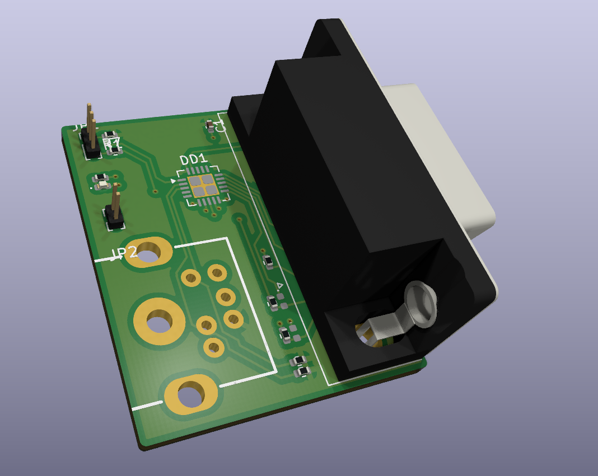

# PS/2 PC Mouse to MSX Mouse Converter



KiCad schematic project for the 2009 Kami Karilov PS/2-to-MSX mouse converter reference design.

Version 2.0

Warning!!! This is still in concept stage. further testing is required. Not ready for production, please test (electrically) before plug in your MSX / Roland.

BOM not available yet
Required parts can be found in the schematic. To keep the pcb clean I removed nearly all markers, deignators and text. 
Please note the pins on the mini-din connector. I removed pin 2 and 6 to make room for traces and let the Vcc plane intact.

Also, the dsub 9 connector should be the female variant ofcourse. I used the male footprint+3Dmodel in Kicad.

And the ATTiny2313 footprint might be incorrect. As far as I know The center pad should not be split in 4 quadrants. Still needs reviewing.


## User manual

This manual is adapted from the original project page by Kamil Karimov (caro):
<https://caro.su/msx/mous4msx.htm>

### What it does

The controller connects to either MSX joystick port and allows an IBM PS/2 mouse
to be used as an MSX mouse or as an MSX joystick. The controller is based on an
Atmel ATTiny2313 running from its internal 8 MHz oscillator.

### Hardware modes

1. Connect the controller to an MSX joystick port and connect a PS/2 mouse.
2. Set the controller switch to `WORK` (contacts 2-3 closed).
3. On power-up, the controller starts in mouse mode and the LED is on.
4. Press the left and right mouse buttons at the same time to switch between
	mouse mode and joystick emulation mode. Repeat the action to switch back.
5. In joystick mode the LED is off. JP2 can be used to select the mouse
	resolution when a modern optical mouse reports movement too quickly.

If the LED flashes approximately once per second, the mouse was not detected.
Check the mouse, its PS/2 compatibility, the PS/2-to-USB adapter if one is
being used, and the controller wiring.

### Programming connection

The controller can be programmed directly from the MSX joystick port. Set the
switch to `PROG` (contacts 1-2 closed) before starting the programmer. The
ATTiny2313 connections are:

| ATTiny2313 | Function | MSX joystick pin/signal |
| ---: | --- | --- |
| 1 | RESET | 8 / STROBE |
| 17 | MOSI | 6 / TrgA |
| 18 | MISO | 1 / Up |
| 19 | SCK | 7 / TrgB |
| 20 | VDD | 5 / +5 V |
| 10 | GND | 9 / GND |

Confirm the pinout and power wiring before applying power. The original design
is experimental and should be electrically tested before connecting it to an
MSX or Roland computer.

### Updating the firmware

The `software` folder contains the original downloads and extracted files:

- `software/msx_ms21/msx_ms21.hex` - firmware version 2.1.
- `software/prg2313t/PRG2313T.COM` - MSX programmer version 0.4.
- `software/prg2313t/prg2313t.src/` - programmer source and build files.

On an MSX, copy `PRG2313T.COM` and the desired Intel-HEX file to an accessible
drive, set the controller to `PROG`, and run:

```text
A>PRG2313T MSX_MS21.HEX
```

The programmer checks for an ATTiny2313, reads its signature, fuse settings and
current firmware, then updates the fuses for the internal 8 MHz oscillator if
needed. If the firmware differs, it writes and verifies the new image and
reports `Ok` or `Error`. Running the command without a HEX filename only
reports the detected controller and its current state.

After programming, power off, return the switch to `WORK`, and reconnect the
mouse. The included programmer documentation describes the original MSX
environment and command behaviour in more detail.

### Download attribution

The files in `software/` were downloaded from the original project page on
2026-09-10. They are retained here for use with this hardware project; the
original author and any notices included with the downloaded files remain the
authoritative source for their licensing and redistribution terms.
